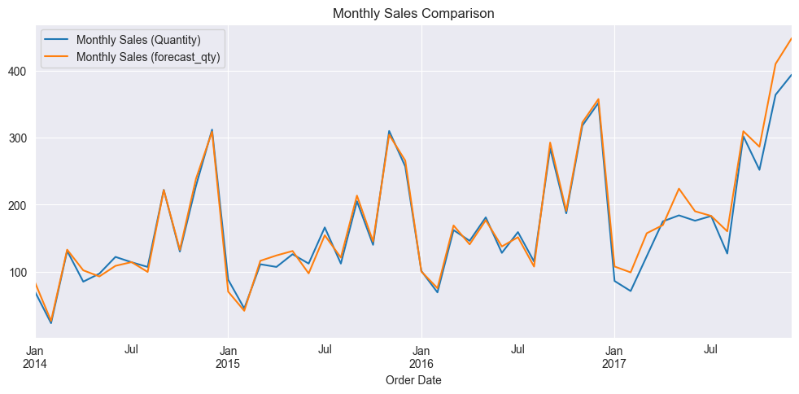

## Question #1 : Préparation des données
Comme c’est souvent le cas dans les projets, le jeu de données peut nécessiter quelques
manipulations pour être utilisable par une approche ML.

   - Si tu rencontres des problèmes de qualité des données durant ta manipulation des
données de ventes, comment les as-tu résolus?
   - Limite-toi aux trois enjeux les plus pertinents selon toi (appuie-toi avec un visuel).
   - Est-ce que les insights trouvés peuvent être transformés en features qui faciliteront
   l'apprentissage du modèle ML?

RESPONSE:
- The analysis is done in the `eda.ipynb` notebook, and the replies to this question are summarized there, and will be explained in the presentation as well.
- As I did not have access to a large dataset, I did not take out any of the data as `test set`, and assumed that has been done prior to this test, without loss of generality. Had I done that, I would have made sure that any standardization etc. was only done 
on the train/valid set, and not the test set, as the assumptions is that we do not have access to the test set, and we should not use it in any way to influence the model training.

- In short, the following items was what I was looking for initially, that could have the most important effects:
  - Missing Values, which would have needed imputation, but there were none
  - duplicates (of rows especially), which there were none
  - detecting categorical features, and understanding the unique values in them, and their distribution
  - Understanding the seasonality, and the temporal aspect of the data and the corresponding features.  
  


## Question #2 : Insights et interprétation
Identifie des insights qui, selon toi, peuvent contribuer à comprendre les variations des ventes.

- En tenant compte des parties prenantes visées par ta solution, comment interprètes-tu
les résultats produits par ta solution ML? Comment cette solution ajoute-t-elle de la
valeur pour ces parties prenantes?
- Selon toi, comment envisage-tu que les parties prenantes vont utiliser ta solution pour
tenter de comprendre comment augmenter les ventes?


RESPONSE:
- The resutls could be interpreted as follows. Initially, metrics can be explained to show the performance level of the
trained model. Once that is done, feature importance aspects can be explained to demonstrate the most important features
on the sales quantity forecast. AS such, the store managers can tweek the most imporatant factors to get the best results, or
they can focus more on the temporal factors. One signifinacnt outcome of this predictive model would be enabling the store managers
to forecast demaned nd adjust inventory levels accordinglyt. There coud be lead times, and outages, and by knowing in advance they
could be better prepared. 
- They could also understand good and bad performing products / regions / segments and try to improve the situatiosn for them.


- In my point of view, this part of the test which is "Predictive Modeling" is one part of a bigger problem.
The complemetary part would be a "Prescriptive model" that uses the forecasts, and helps the store manager to optimize
differnt aspects of the business. As an example, imagine one desries to have a "Discount / Promotion" planning model. Based 
on these forecasts, they will be able to use these values in an optimization model. 


### Feature impact analysis:

#### Shap values:
Contribution of each feature to the model's predictions can be interpreted using SHAP values. Usually in valid set.
- Positive value --> pushes the prediction higher
- Negative value --> pushes the prediction lower
- The horizontal position shows how much that feature changed the model’s prediction for that specific row.

For training:
- Original Price is the most impactful feature.
  - Some significantly increased qty, some decreased it.
  - model very sensitive to this feature.
  
- Product ID next most impactful.

- WeekOfYear cyclic encoding
    - Seasonality is very important

- Discount
    - not always having a discount results in higher sales. 


#### Feature Importance: (Observations similar with correlation heatmap)

how useful each feature is in making predictions across the entire dataset. Usually on train set.

- Product ID is the most important feature, followed by Original Price and Region features.
  - Some products may be more popular or have higher demand, leading to higher sales.
  - model correlates with price, as expected.
  


#### Permutation Importance

Randomly shuffling the values of features and observing how much model performance drops as a result.

- If a feature is important, shuffling it will break patterns and degrade performance.
- More negative values, mean higher importance

- top features: 
  - Original Price, Product ID, Discount


### Metrics analysis

- MAE (Mean Absolute Error) Train: 1.34 | Valid: 1.88
- MSE (Mean Squared Error) Train: 3.02 | Valid: 5.61
  - High sensitivity to outliers.

- RMSE (Root Mean Squared Error) Train: 1.74 | Valid: 2.37
  - the same scale as the original variable. Easier to interpret than MSE. (sensitive to outliers)

- Bias (Mean Error) Train: 0.03 | Valid: 0.45
  - Positive bias suggests consistent overprediction. validation bias is moderately high

- MAPE (Mean Absolute Percentage Error) Train: 48.5% | Valid: 80.5%
  - These values are high, especially in validation. This may signal unstable performance

- Median APE (Median Absolute Percentage Error) Train: 30.98% | Valid: 47.73%
  - More robust than MAPE (less sensitive to extreme values).
  - rather high values 

- MPE (Mean Percentage Error) Train: 28.98% | Valid: 60.01%
  - Indicates average direction of error (i.e., systematic bias in % terms).
  - overpredicting on average 



2017 onwards is the validation set.


In general,

    - there could be some levels of overfitting (can use higher regularization),
    - the model is not very generalizable, as the validation metrics are significantly higher than the training metrics.
    - use simpler models or ensemble methods (like random forest regressor)


## Question #3 : Solution ML
Décris l'approche ML que tu as utilisé pour prévoir les ventes. Pourquoi as-tu choisi cette
approche? Quels sont les avantages et les inconvénients de cette approche?

RESPONSE:

For this exercise, and based on the limitation of time, after performing the EDA and getting acquainted with the data, 
I decided to use a model that could more reasily adapt to categorical features, as well as being a good model. Therefore,
instead of using regressors from `lightgbm` or `xgboost`, I decided to use `CatBoostRegressor` from the `catboost` library.
In my experience, CatBoost is a powerful gradient boosting library that handles categorical features well, and it provides
its own shapley values and feature importance metrics, which can be useful for interpretability.

The other reason is Catboost is ideal for prototyping and figuring out the presence signal in the data, and it is less
prone to overfitting when dealing with rather small datasets (as here).


## Question #4 : Dégradation de la performance
Imaginons que ta solution est déployée et roule maintenant en production. Tu remarques que la
performance de ton modèle se dégrade progressivement depuis les derniers mois. De plus, tu
identifies également certaines variables dont les valeurs semblent avoir évolué durant la même
période. Selon toi, quelle serait une raison qui explique cette situation et comment la
résoudrais-tu?


RESPONSE:

In short, it would be beneficial to have a monitoring schedule or and alert system in place to detect such performance degradation.
By doing so, one could quickly intervene, and fix the issues. 

   1. One of the reasons for this could be the change in the distribution of the input
features over time. This would mean that during the training, the model has not been 
exposed to the new changes, and therefore, is not as generalizable. 

- **Solution**:
  I would suggest retraining the model with the latest dataset.

2. Based on external factors, the conceptual relationship between the features and the target variable may have changed.
As such, the model's assumptions about the intrinsic relationship between features and the target variable does not hold.

- **Solution**:
  I would suggest re-evaluating the model's assumptions and potentially updating the model architecture or features to better capture the new relationships.


## Question #5 : Intégration de l'IA générative
Comment l'IA générative pourrait-elle être intégrée dans un système de prévision des ventes
pour soutenir les utilisateurs finaux de ce modèle?
• Donne un exemple d'architecture où l'IA générative pourrait être utilisée.
• Propose un exemple de prompt qui pourrait être utilisé pour interagir avec l'IA générative.

RESPONSE:
Using generativ AI in a sales forecasting system can increase user engagement and provide intrepretability.
As per my experience, I do not suggest using Gen AI to generate the forecasts themselves.

- **Example Architecture**:
  - Develop a user interface (chatbot for example with Streamlit) and develop a text2SQL or text2Code model, that interacts with the structured data sources, and extracts insights from different databbases.
    - Certainly, this requires access to historical question + SQL query (Code) pairs that are embedded and the most relevant ones can be retrieved and added to context.
    - As such, this could help store managers easily ask questions about the data and access (not so detailed) responses. Examples could be seasonality, different segments, total sales yearly, or each quarter, etc.

  - A significant use case of Gen AI would be to generate explanations, interpretations and insights reagarding the metrics generated by the models. 
    - As an example, imagine a case where an LLM receives the metrics, ferature importance factors (shap, etc.) and provides intrepretations and expalantions to the store managers.
    - This can be tailored to provide non-technical details, such that store managers can easily understand and be able to make startegic decisions based on the model's. For example, they realize that `Discount` is driving the sales, so they can play around with that. 
  
  - Another use case would be to develop an LLM model that could choose the best performing model among different regressors for instance.
    - This could be done by providing the LLM with the training and validation metrics, and it can suggest which model to use based on the performance metrics.
  


As for the prompt, I would suggest a prompt like this:

```aiignore
PROMPT_TEMPLATE = """
You are a database and a SQL expert.

You are given a question, a few examples of relevant question-SQL pairs, and schemas of relevant tables.

Your task is to generate a SQL query that answers the question based on the provided examples and schemas.
You will use the examples to understand the logic and the related columns from the database to generate your response.

**********************************
Here's the question:
[Question]
{QUESTION}

**********************************
These are the examples;
[Examples]
{EXAMPLES}

**********************************
Here are the schemas of relevant tables:
[Schema]
{SCHEMA}

**********************************
[ANSWER]
Write a SQL query that answers the question based on the provided examples and schemas.
Report all of the analysis steps in your response.
"""
```

Of course, this is a simplified example and requires many other parts to capture errors and fix them.
Imagine we have an LLM client as follows:

```python
class GenAIGeminiClient(BaseLLMClient):
    def __init__(
        self,
        model_name: str,
        project: str,
        location: str,
    ) -> None:
        import google.auth
        from google import genai

        self.model_name = model_name

        credentials, _ = google.auth.default()
        self.client = genai.Client(
            vertexai=True,
            credentials=credentials,
            project=project,
            location=location,
        )

    def get_completion(
        self,
        messages: str
    ):
        response = self.client.models.generate_content(
            model=self.model_name,
            contents=messages,
        )

        return response.text
```

and then we can use it as follows:

```python

llm_client.get_completion(
    messages=PROMPT_TEMPLATE.format(
        QUESTION=QUESTION,
        EXAMPLES=EXAMPLES, # list of retrieved examples bassed on question in the previous steps of the pipeline
        SCHEMA=SCHEMA  # schema of the relevant tables
    )
),

```

Another example of a prompt could be:

```aiignore
PROMPT_TEMPLATE = """
Based on the performance metrics of the model and feature importance, provide a summary of key takeaways, 
and suggest strategiees to improve sales performance."
"""
```


Here’s how to interpret these metrics:

### Training Metrics:
1. **MAE (Mean Absolute Error)**: 1.66  
   - On average, the model's predictions are off by 1.66 units from the actual values.

2. **MSE (Mean Squared Error)**: 4.45  
   - The squared error penalizes larger errors more heavily. This value indicates the average squared difference between predictions and actual values.

3. **Bias**: 0.068  
   - The model has a slight positive bias, meaning predictions are slightly higher than the actual values on average.

4. **MAPE (Mean Absolute Percentage Error)**: 0.61 (61%)  
   - On average, the model's predictions deviate by 61% from the actual values.

5. **Median APE (Median Absolute Percentage Error)**: 0.36 (36%)  
   - The median percentage error is lower than the mean, indicating that most predictions are closer to the actual values, but a few outliers may inflate the MAPE.

6. **MPE (Mean Percentage Error)**: 0.39 (39%)  
   - The model tends to overpredict by 39% on average.

7. **RMSE (Root Mean Squared Error)**: 2.11  
   - The RMSE is higher than the MAE, indicating that there are some larger errors in the predictions.

---

### Validation Metrics:
1. **MAE**: 1.82  
   - The average error on the validation set is slightly higher than on the training set, indicating a small performance drop.

2. **MSE**: 5.18  
   - The squared error is higher on the validation set, suggesting the model may not generalize as well.

3. **Bias**: 0.416  
   - The model has a stronger positive bias on the validation set, overpredicting more frequently.

4. **MAPE**: 0.78 (78%)  
   - The percentage error is higher on the validation set, indicating reduced accuracy.

5. **Median APE**: 0.43 (43%)  
   - The median percentage error is higher, suggesting the validation set has more challenging cases.

6. **MPE**: 0.59 (59%)  
   - The model overpredicts more on the validation set compared to the training set.

7. **RMSE**: 2.28  
   - The RMSE is higher on the validation set, confirming the presence of larger errors.

---

### In overall:
- The model performs better on the training set than the validation set, which is expected but should be monitored for overfitting.
- The **bias** and **MPE** indicate a tendency to overpredict, especially on the validation set.
- The gap between training and validation metrics is not extreme, suggesting the model generalizes reasonably well but could benefit from further tuning or regularization.